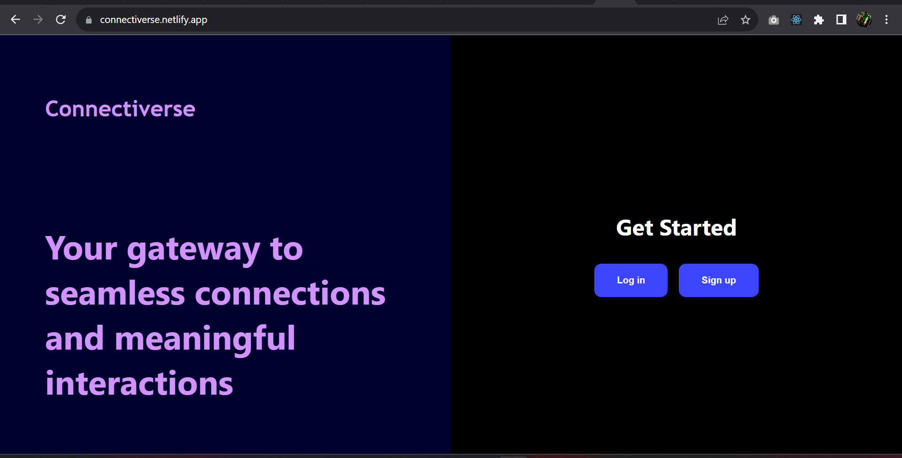

# Connectiverse - Social Media Application

Connectiverse is a social media application built with React that allows users to connect, share posts, and interact with each other.

## Features

- User registration and login.
- User profile management.
- Create, update, and delete posts.
- View and interact with posts in a news feed.
- View and edit user profiles.
- Responsive design for various screen sizes.

## Project Structure

src/
|-- components/
| |-- common/
| | |-- Navbar.js
| |-- users/
| | |-- Register.js
| | |-- Login.js
| | |-- UserProfile.js
|-- pages/
| |-- LandingPage.js
| |-- LoginPage.js
| |-- HomePage.js
| |-- UserPosts.js
| |-- UserPost.js
| |-- NotFound.js
|-- services/
| |-- api.js
|-- App.js
|-- index.js

## Table of Contents

- [Demo](#demo)
- [Installation](#installation)
- [Usage](#usage)
- [API](#api)
- [Technologies Used](#technologies-used)
- [Contributing](#contributing)
- [License](#license)

## Demo

- A live demo of the application can be accessed at: [Connectiverse Demo](https://connectiverse.netlify.app/)
- Alternate Link: https://connectiverse-react.vercel.app

## Installation

1. Clone the repository: `git clone https://github.com/your-username/connectiverse.git`
2. Navigate to the project directory: `cd connectiverse`
3. Install dependencies: `npm install`

## Usage

1. Start the development server: `npm start`
2. Open your browser and navigate to `http://localhost:3000`

## API

The frontend interacts with the backend API for user authentication, post creation, and other functionalities. Refer to the [Connectiverse Backend API Documentation](https://link-to-api-docs.com) for details on available endpoints and how to use them.

## Technologies Used

- React
- React Router
- Axios (for API requests)
- Styled Components (for styling)
- ...

## Contributing

Contributions are welcome! To contribute to Connectiverse, follow these steps:

1. Fork the repository
2. Create a new branch: `git checkout -b feature-name`
3. Make your changes and commit them: `git commit -m 'Add some feature'`
4. Push to the branch: `git push origin feature-name`
5. Create a pull request

## License

This project is licensed under the [MIT License](LICENSE).
